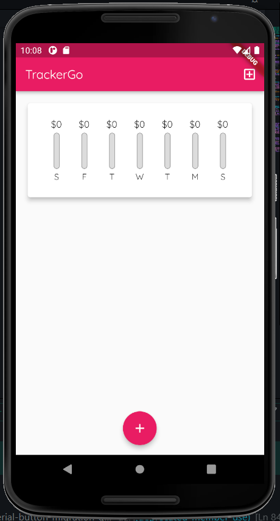
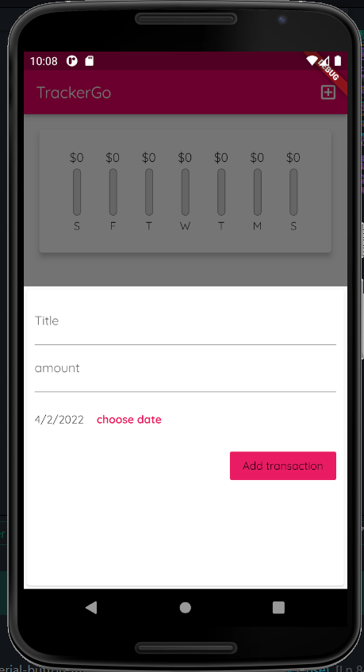
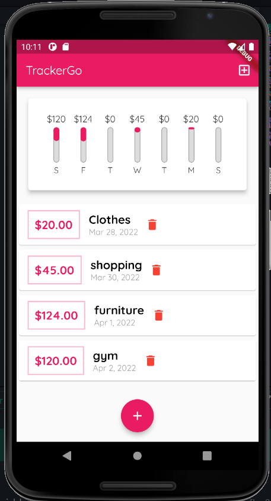

# TrackerGo
 <h2 align = "center"> ◀️ Introduction ▶️ </h2>

 TrackerGo makes managing personal finances as easy as pie! Now easily record your personal and business financial transactions, generate spending reports, review your daily, weekly and monthly financial data and manage your assets with TrackerGo's spending tracker and budget planner.

  

#### Tech-Stack used :

<!--   
<code> -->
  
  

### Screenshots
   

### Getting Started

1. Install [Flutter](https://flutter.io)
2. Clone the repo
3. Run `flutter run` (make sure to have an emulator running).

